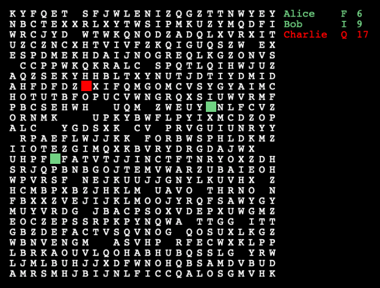

# alphabet
Multi-user game illustrating the use of web sockets


## PRESENTATION

This little game shows how to use websockets to program
a real-time multi-user game.

The board is a 26x26 square randomly filled up with letters.

Each player uses the arrow keys to collect the letters
in the alphabetic order, then from A again.
Each collected letter is removed from the board, and the
score of the player is incremented :



## USAGE

Start the server :
```
node server.js
```

Open the page on a browser :
```
http://myaddress:8000
```

## ROBOT

In addition, a robot can be launched, to remove all hope of
victory for the human players :-)

```
node robot.js
```
